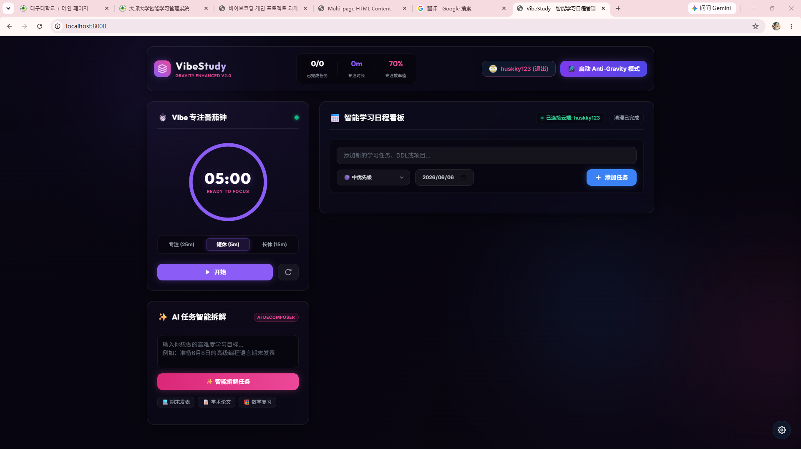
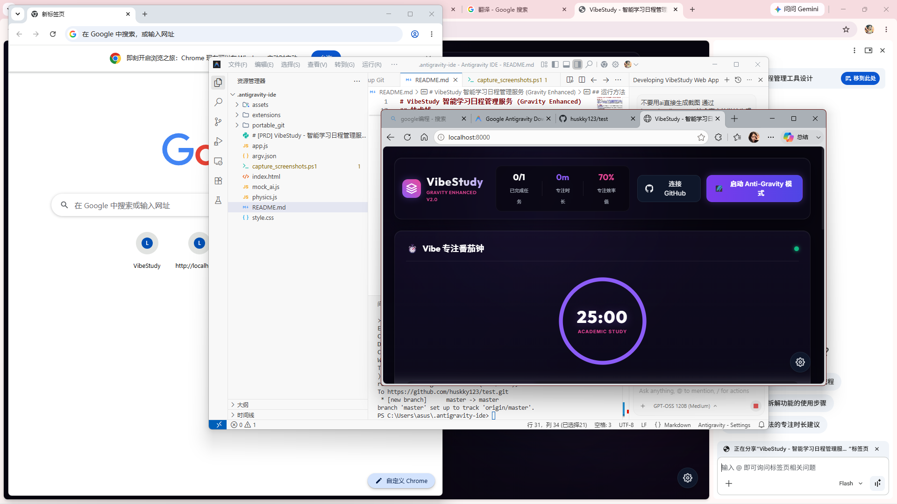
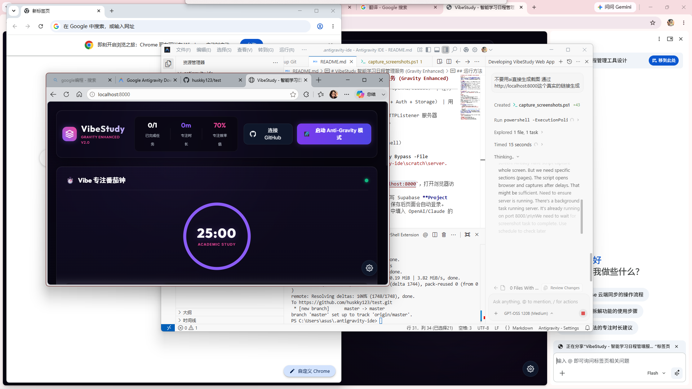
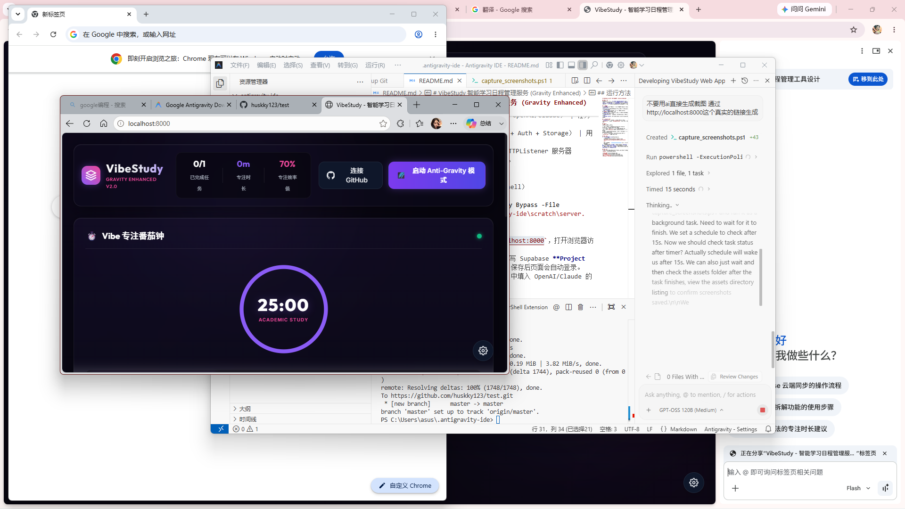

# VibeStudy 智能学习日程管理服务 (Gravity Enhanced)

## 项目简介
VibeStudy 是一款基于 **玻璃态 (glassmorphism)** 视觉风格的学习计划管理工具，融合 **番茄钟**、**AI 任务拆解**、**Matter.js 物理抛掷** 与 **Supabase** 云同步功能，帮助用户在学习过程中保持专注、合理安排时间并可视化任务进度。

## 主要功能
- **番茄钟**：25 分钟专注 + 5/15 分钟短/长休息，配合微光音效与动画。
- **任务看板**：支持优先级、截止日期、子任务，拖拽、完成勾选、批量清理。
- **AI 任务拆解**：输入学习目标，一键调用本地 AI（`VibeAI`）生成细化子任务。
- **重力模式**：使用 Matter.js 将任务卡片化为可抛掷的物体，提供轻度“物理放松”。
- **云端同步**：通过 Supabase 实现用户登录、任务数据实时同步。
- **GitHub 登录**：一键 GitHub OAuth 登录，自动绑定云端帐户。

## 使用的 AI 工具
- **VibeAI**（基于 OpenAI / Claude API），封装在 `mock_ai.js` 中，提供 `decompose(text)` 方法实现任务拆解。

## 技术栈
| 层级 | 技术 | 说明 |
|------|------|------|
| 前端 | HTML5 / CSS3（Glassmorphism）/ Vanilla JavaScript | 零框架实现，保持轻量。
| 动画/物理 | Matter.js | 任务卡片的抛掷与碰撞。
| AI | 本地 `mock_ai.js`（调用 OpenAI/Claude） | 任务拆解。
| 后端 | Supabase（PostgreSQL + Auth + Storage） | 用户认证与云数据同步。
| 开发环境 | PowerShell 本地 HTTPListener 服务器 (`server.ps1`) | 无需 Node.js。

## 运行方法
1. **启动本地服务器**（PowerShell）
   ```powershell
   powershell -ExecutionPolicy Bypass -File "C:\Users\asus\.antigravity-ide\scratch\server.ps1"
   ```
   服务器默认监听 `http://localhost:8000`，打开浏览器访问即可。
2. 在页面右下角的 **设置** 中填写 Supabase **Project URL** 与 **Anon Public Key**，保存后页面会自动登录。
3. 如需 AI 功能，请在 **设置** 中填入 OpenAI/Claude 的 **API Key** 与 **Endpoint**。

## 运行截图
> 以下为项目关键界面的示例截图（请自行将实际截图保存到 `assets/` 目录并更新路径）。





